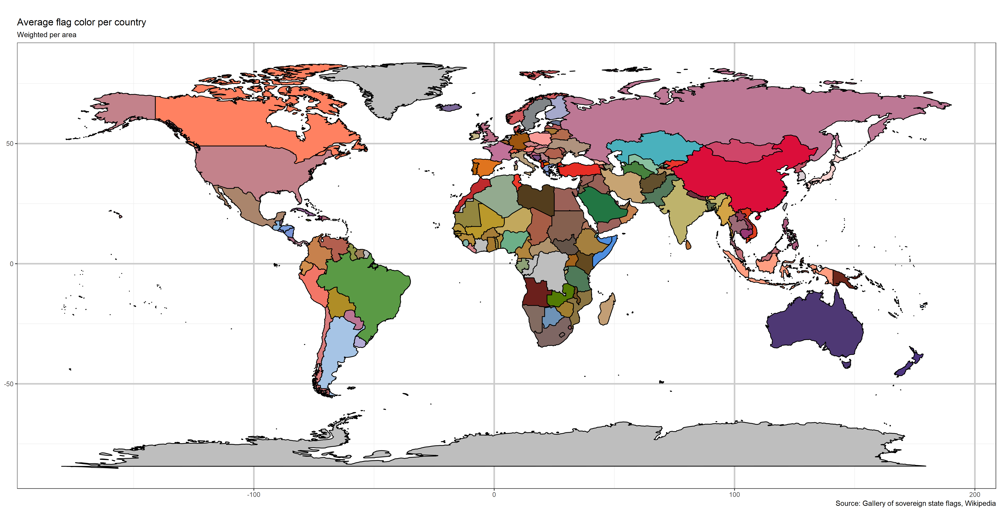

Average flag color
================
Márcio Martins
11 de Dezembro de 2017

Small project that scrapes flags from wikipedia page, converts the vector files to raster, converts the colors from RGB to Lab\* color space and then averages the colors (mathematical operations in Lab\* color space result in more intuitive results, based on our perception of color).

An attempt at plotting the result as an animated 3D globe is included. Problems in how ggplot handles polygon clipping makes it have flaws, but it's decent. Unfortunately I have not managed to export it as a .gif with decent quality, but the .mp4 is much better.

README is in construction, plenty of comments were included in the R script to make it understandable.

``` r

```


``` r
include_graphics("rotation_globe.gif")
```


